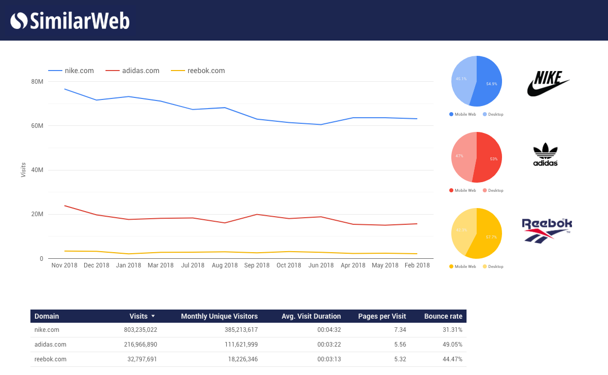

# SimilarWeb Connector for Google Data Studio - Monthly Visits and Engagement

Custom connector for Google Data Studio that will let you import the monthly Desktop & Mobile Web visits, unique visitors and engagement metrics to Google Data Studio using the SimilarWeb API. 
A SimilarWeb API key is required to import the data. You can get yours by following this link: https://account.similarweb.com/#/api-management (requires a SimilarWeb Pro account).

## Preview
Here's an example GDS report using this connector:




## Getting Started
These instructions will get you a copy of the project up and running on your local machine for development and testing purposes.

### Prerequisites
To start working on this project you just need the following:
* Node.js >= v6.0.0
* Node Package Manager
* A Google Account

### Installing
Checkout the latest master branch from GitHub and navigate to it using your Terminal or Command Prompt, then run the following to install all the dependencies:
```
npm install
```

If you're not already logged in Clasp with your Google Account, run
```
npm run clasp-login
```

The following command will initialize a new Standalone Google Apps Script with the code:
```
npm run new-script
```

## Running the tests
To run the tests just run the following
```
npm run test
```

And to show the test coverage
```
npm run coverage
```

## Deployment
After modifying the connector you can push the changes to Google Apps Script using
```
npm run push
```

Then open the script in your browser
```
npm run open
```

And use the web interface to deploy the connector as described in their help pages: https://developers.google.com/datastudio/connector/deploy

## Authors
* Gregory Fryns - *Initial work* - https://github.com/gregoryfryns

## Acknowledgements
This connector is inspired by [Bajena's Spotify Data Studio Connector](https://github.com/Bajena/spotify-gds-connector). His [blog post](https://itnext.io/building-a-custom-google-data-studio-connector-from-a-z-b4d711a5cf58) was particularly helpful and helped me get started with this connector.

To subscribe to a SimilarWeb Pro account, just go this way: www.similarweb.com
